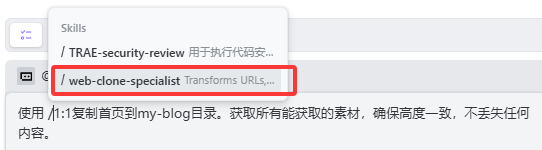

> 帮我安装好 https://www.skill.fish/skill/web-clone-specialist

> 我需要你先专门建立一个文件夹，用来制作我的博客，先要保证本地可以运行查看，后续再规划gihub上线的问题。不要开始制作。只建立文件夹，然后分析https://shw2018.github.io/的技术栈和初步实现路径，先记录下来即可

> 使用（这使得输入：先按“/”，调出skill选项，再选择web-clone-specialist）1:1复制首页到my-blog目录。获取所有能获取的素材，确保高度一致，不丢失任何内容。
> 操作实例： 