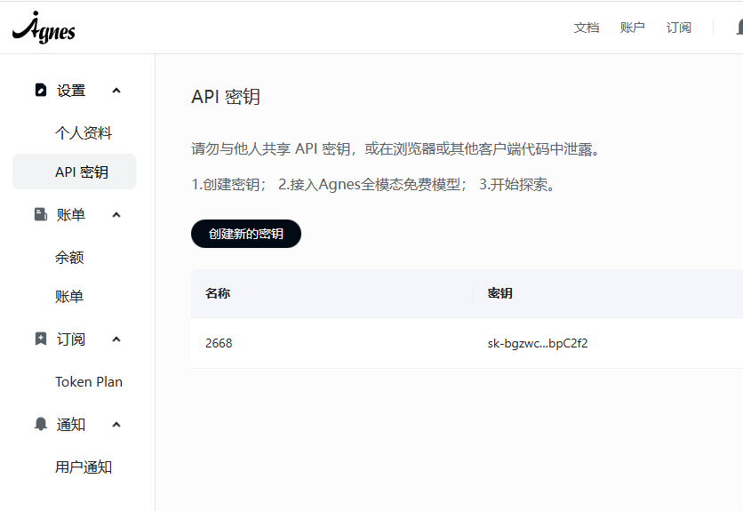
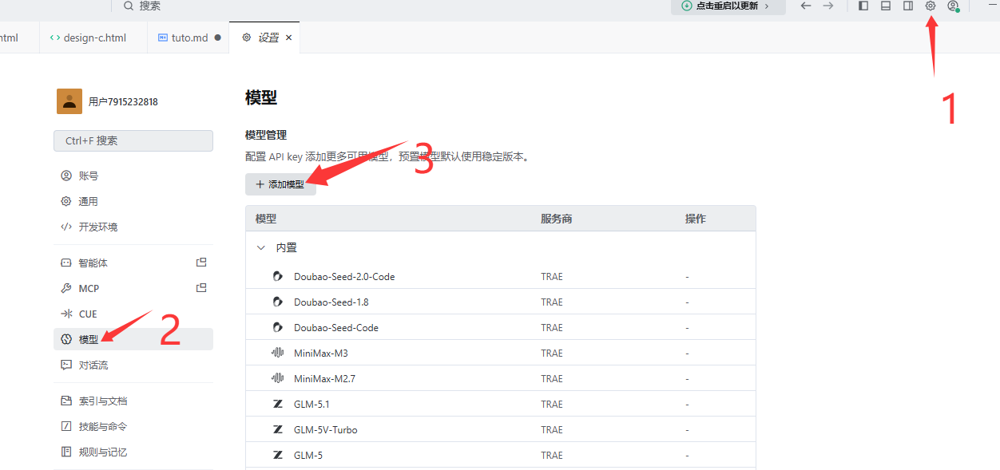
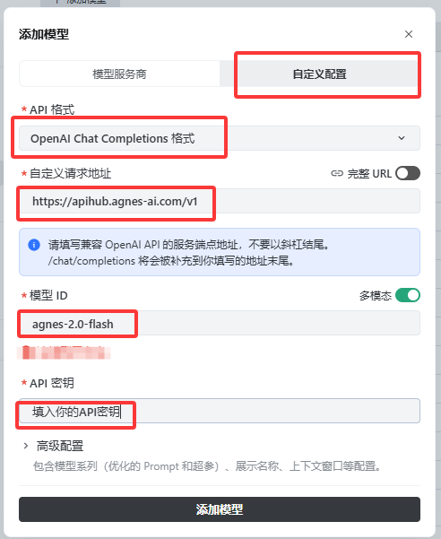
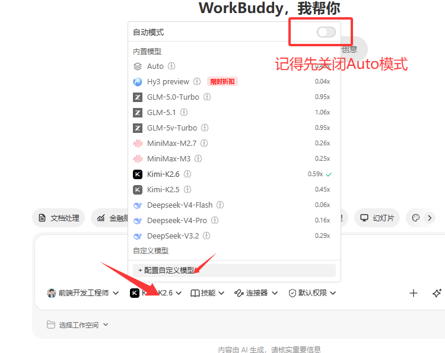
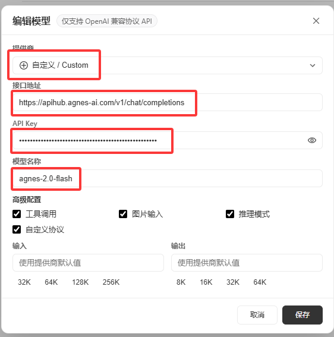

# Agnes AI API Key 获取与配置教程

## 第一步：获取 API Key

### 1. 注册登录

访问以下链接，注册并登录：

> [https://platform.agnes-ai.com/settings/apiKeys](https://platform.agnes-ai.com/settings/apiKeys)

---

### 2. 创建 API Key

登录成功后，再次访问上述链接，点击创建 API Key。

---

### 3. 复制并保存

复制创建好的 API Key 并妥善保存。

---

## 第二步：配置开发工具

### 1. Trae CN 配置

**需要填入的信息：**

| 配置项 | 值 |
|--------|------|
| API Base URL | `https://apihub.agnes-ai.com/v1` |
| Model | `agnes-2.0-flash` |
| API Key | 你创建的 API Key |

---

### 2. WorkBuddy 配置

**需要填入的信息：**

| 配置项 | 值 |
|--------|------|
| API Base URL | `https://apihub.agnes-ai.com/v1/chat/completions` |
| Model | `agnes-2.0-flash` |
| API Key | 你创建的 API Key |

---

> ⚠️ **注意：** `https://apihub.agnes-ai.com/v1/chat/completions` 是 **WorkBuddy** 的 API 地址，不是 Trae CN 的 API 地址，请勿填错。
